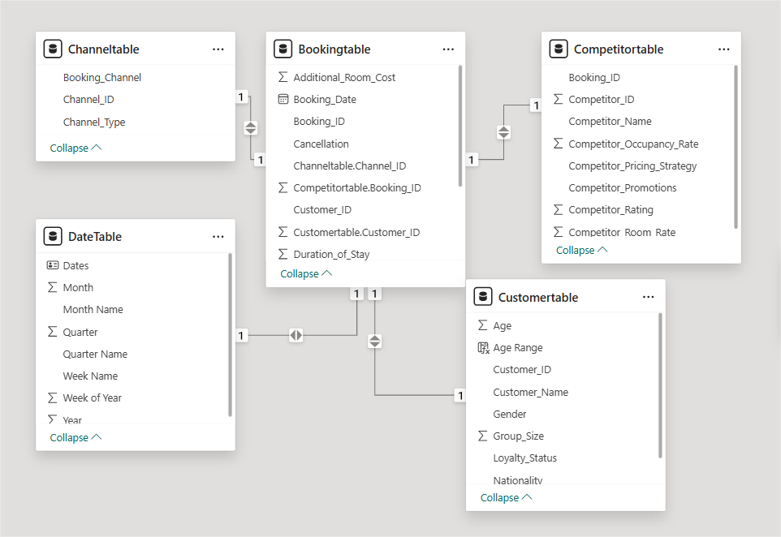
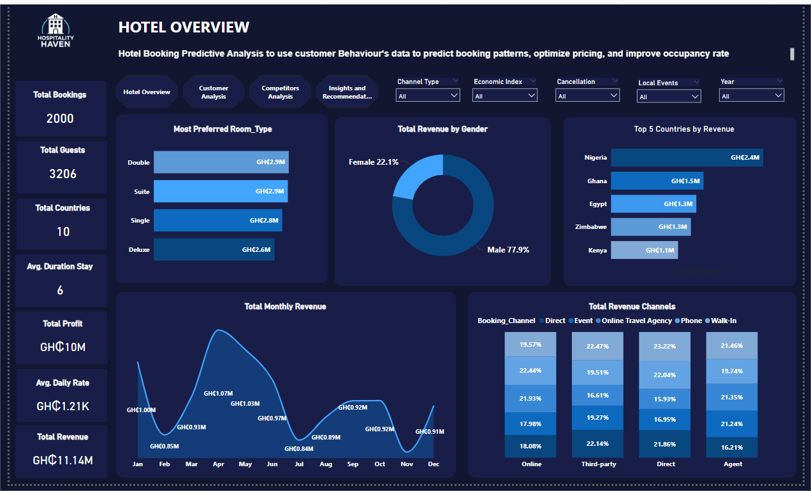
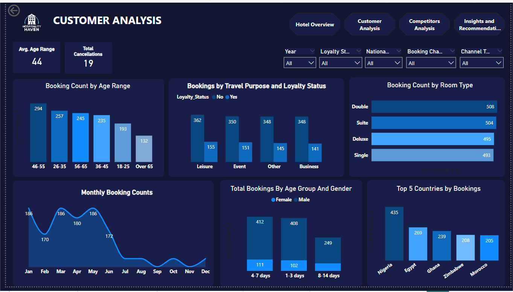
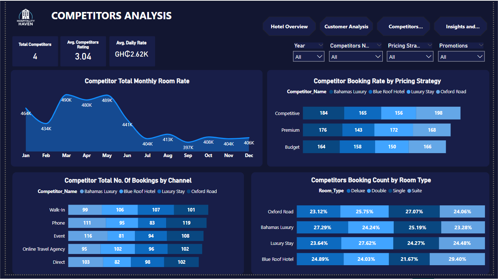

# Hotel Booking Predictive Analysis

## Leveraging Customer Behavior Data to Optimize Revenue and Occupancy

## Background and Overview

Hospitality Haven is a global hotel chain established in 2012, operating luxury hotels, boutique properties, resorts, and business hotels across key tourist destinations. The company faces critical challenges in the highly competitive hospitality industry, including unpredictable seasonal booking patterns, complex pricing optimization, and the need to better understand evolving customer behavior.

This analysis addresses the company's core operational challenges by examining historical booking data to uncover actionable insights that will drive revenue optimization, improve occupancy rates, and enhance competitive positioning.

### Key Analysis Areas:

- Revenue trend analysis and seasonal pattern identification
- Customer segmentation and behavior analysis
- Competitive benchmarking and pricing strategy assessment
- Channel performance optimization
- Demand forecasting for operational efficiency

View Technical Implementation here (Haven_Home_Predictive_Analysis/Haven_Home_Predictive_Analysis.pbix)

### Data Structure Overview
The analysis utilizes a comprehensive hospitality dataset that was transformed during the ETL process from a single denormalized dataset into four normalized tables to reduce redundancy and improve data integrity:
#### Data Architecture:
- **Original Dataset:** Single table containing all customer, booking, competitor, and channel data
- **ETL Transformation:** Normalized into 4 relational tables with appropriate keys
- **Final Structure:** Star schema design optimized for analytical queries

**Booking Table** (Primary fact table - 2,000 records)
| Column | Description |
|--------|-------------|
| Booking_ID | Unique identifier for each booking transaction |
| Customer_ID | Foreign key linking to customer table |
| Booking_Date | Date when reservation was made |
| Duration_of_Stay | Number of nights for the reservation |
| Room_Type | Type of room booked (Single, Double, Suite, Deluxe) |
| Room_Rate | Nightly rate charged for the room |
| Additional_Room_Cost | Extra charges associated with the booking |
| Travel_Purpose | Purpose of travel (Business, Leisure, Event, Other) |
| Group_Size | Number of guests in the booking party |
| Local_Events | Local events occurring during stay period |
| Cancellation | Booking cancellation status (Yes/No) |

**Customer Table** (Dimension table - 3,206 unique customers)
| Column | Description |
|--------|-------------|
| Customer_ID | Unique customer identifier |
| Customer_Name | Full name of the customer |
| Gender | Customer gender classification |
| Age | Customer age at time of booking |
| Nationality | Customer's country of origin |
| Loyalty_Status | Customer loyalty program participation status |

**Channel Table** (Dimension table)
| Column | Description |
|--------|-------------|
| Booking_Channel | Channel through which booking was made |
| Channel_Type | Category of booking channel (Online, Direct, Third-party) |

**Competitor Table** (Dimension table - 4 competitors)
| Column | Description |
|--------|-------------|
| Competitor_ID | Unique identifier for competitor |
| Competitor_Name | Name of competing hotel/chain |
| Competitor_Room_Rate | Competitor's room rate for comparison |
| Competitor_Occupancy_Rate | Competitor's occupancy percentage |
| Competitor_Promotions | Promotional offers by competitor |
| Competitor_Rating | Customer rating/review score for competitor |
| Competitor_Pricing_Strategy | Competitor's pricing approach (Premium, Competitive, Budget) |
| Economic_Index | Economic indicator related to competitor performance |

### Key Metrics Calculated:

- Total Revenue: Room rate × Duration (excluding cancellations)
`Total Revenue = CALCULATE(SUMX(Bookingtable, Bookingtable[Room_Rate] * Bookingtable[Duration_of_Stay]), Bookingtable[Cancellation] = "No")`

- Total Profit: Revenue minus additional room costs
`Total Profit = CALCULATE(SUMX(Bookingtable, (Bookingtable[Room_Rate] * Bookingtable[Duration_of_Stay]) - Bookingtable[Additional_Room_Cost]), 'Bookingtable'[Cancellation] = "No")`

- Cancellation Rate: Percentage of cancelled bookings
`Cancellation Rate = DIVIDE(COUNTAX(FILTER(Bookingtable, Bookingtable[Cancellation] = "Yes"), Bookingtable[Cancellation]), COUNT(Bookingtable[Booking_ID]),0) * 100`

- Total Loss
`Total Loss = CALCULATE(SUMX(Bookingtable,(Bookingtable[Room_Rate] * Bookingtable[Duration_of_Stay]) - Bookingtable[Additional_Room_Cost]), Bookingtable[Room_Rate] * Bookingtable[Duration_of_Stay] < Bookingtable[Additional_Room_Cost])`

## Executive Summary
After analyzing booking patterns from 2012-2017, Hospitality Haven generated GHC 11.14M in total revenue with GHC 10M in profit, but faces significant operational challenges that require immediate attention.

### Key Findings:

- **Revenue volatility:** Peak revenue of GHC 1.07M in April declined to GHC 0.89M in July, indicating strong seasonal dependency
- **High cancellation rate:** 18.65% cancellation rate represents substantial revenue leakage
- **Channel concentration:** Online Travel Agents drive GHC 9.12M (80%+) of revenue, creating dependency risk
- **Gender revenue gap:** Male guests contribute GHC 6.68M vs. female guests at GHC 2.46M, suggesting untapped market potential

Dashboard snapshot showing key performance indicators and trend analysis.

### Insights Deep Dive

#### Revenue Performance Analysis
Seasonal Revenue Patterns Monthly revenue analysis reveals significant seasonality with April peak (GHC 1.07M) followed by summer decline (July: GHC 0.89M). This 17% revenue drop during traditional travel season suggests pricing strategy misalignment or competitive pressure during peak demand periods.

Channel Performance Concentration Online Travel Agents dominate revenue contribution at GHC 9.12M, while direct bookings, phone, and walk-ins contribute significantly less. This concentration creates operational risk and reduces profit margins due to commission structures.

#### Customer Behavior Insights
Demographic Booking Patterns Analysis shows males aged 18-25 demonstrate highest booking frequency, with males contributing 73% of total revenue (GHC 6.68M vs GHC 2.46M female contribution). Average stay duration of 6 nights indicates strong customer satisfaction with property experience.

Room Type Preferences Double rooms generate highest revenue (GHC 2.90M) followed by suites (GHC 2.90M), with booking distribution relatively even across room types (493-508 bookings per type), indicating balanced inventory utilization.

#### Competitive Intelligence
Market Positioning Analysis Competitor analysis reveals Bahamas Luxury leads premium segment bookings (198), while our property shows competitive performance across pricing strategies. Average competitor daily rate of GHC 2.62K compared to our GHC 1.21K suggests potential for premium pricing optimization.

Geographic Market Performance Nigeria leads booking volume (435 bookings) followed by Egypt (269), indicating strong regional market penetration opportunities and potential for targeted geographic marketing campaigns.

## Recommendations
#### Immediate Actions (0-3 months)
Address Cancellation Rate Crisis With 18.65% cancellation rate, implement flexible rebooking policies and pre-stay engagement programs to reduce revenue leakage. Consider partial refund structures or future booking credits to retain customer relationships while minimizing losses.

Seasonal Revenue Optimization Deploy dynamic pricing strategies during off-peak months (July-August) with targeted promotional packages. Bundle accommodations with local events and attractions to maintain occupancy and average daily rates during demand decline periods.

#### Strategic Initiatives (3-12 months)
Channel Diversification Strategy Reduce dependency on Online Travel Agents by investing in direct booking capabilities. Implement loyalty program enhancements and direct booking incentives to shift 15-20% of volume to higher-margin channels within 12 months.

Female Market Segment Development Given the significant revenue gap (GHC 4.22M opportunity), develop targeted marketing campaigns and service offerings for female travelers. Consider women-centric packages, safety-focused amenities, and partnerships with female-oriented travel platforms.

Premium Pricing Strategy Implementation Competitor analysis shows successful premium positioning opportunities. Enhance service offerings and implement premium pricing for suite categories during peak demand periods, potentially increasing average daily rate by 15-20%.

#### Long-term Growth (12+ months)
Predictive Analytics Integration Implement machine learning models for demand forecasting and dynamic pricing optimization. Use customer behavior data to predict booking likelihood and optimize inventory allocation across room types and seasons.

Geographic Expansion Focus Leverage strong performance in Nigeria and Egypt markets to inform expansion strategy. Consider additional properties in high-performing regions while maintaining operational excellence standards across portfolio.

### Caveats and Assumptions
- **Data Completeness:** Analysis assumes booking data represents complete transaction history; missing data could impact trend accuracy
- **Competitor Benchmarking:** Competitor pricing and occupancy data may not reflect real-time market conditions
- **Seasonal Normalization:** Revenue trends may be influenced by post-pandemic travel recovery patterns not representative of typical seasonality
- **Currency Fluctuations:** Multi-country operations in GHC may be affected by exchange rate variations not captured in analysis
- **Local Events Impact:** External factors like local events, economic conditions, and travel restrictions could influence booking patterns beyond model predictions

This analysis was conducted using Power BI for data modeling, transformation, and visualization. All revenue figures are in Ghana Cedis (GHC). For technical implementation details and additional methodology notes, see technical documentation.

